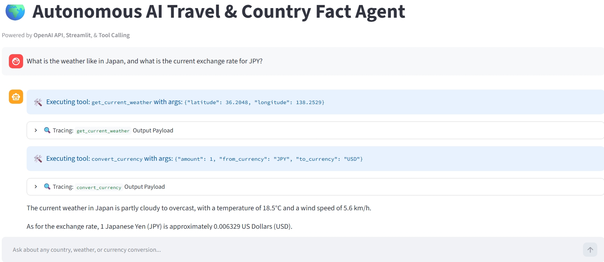

# 🌍 Autonomous AI Travel & Country Fact Agent
> **Multi-Tool Function Calling & REST API Orchestration in Python using OpenAI API**

[](https://www.python.org/)
[](https://streamlit.io/)
[](https://pypi.org/project/openai/)
[](https://opensource.org/licenses/MIT)

---

## 📌 Overview

An interactive, single-agent application built with **Python**, **OpenAI API (`gpt-4o-mini`)**, and **Streamlit**. 

Unlike static text-prompt wrappers, this application demonstrates how Large Language Models perform **dynamic tool selection**, **parameter extraction**, and **REST API orchestration**. The agent dynamically evaluates natural language queries and determines when and how to call external web services (country metadata, live weather forecasts via coordinates, and real-time currency exchange rates) to answer complex travel queries.

---
## 📂 Project Structure

* 📁 **`autonomous-travel-agent-tool-calling/`**
  * 📄 **`app.py`** — Main Streamlit interface & OpenAI agent execution loop
  * 📄 **`tools.py`** — Central module re-exporting local tool functions
  * 📄 **`country_tool.py`** — REST Countries API handler & coordinate extractor
  * 📄 **`weather_tool.py`** — Open-Meteo API handler for live weather data
  * 📄 **`currency_tool.py`** — Frankfurter Exchange Rate API integration module
  * 📄 **`.env.example`** — Environment variable template (`OPENAI_API_KEY`)
  * 📄 **`.gitignore`** — Excludes virtual environments and sensitive keys
  * 📄 **`requirements.txt`** — Python package dependencies
  * 📄 **`README.md`** — Comprehensive project documentation
---

## 💡 Core Concepts Demonstrated

### 1. OpenAI Function / Tool Calling
* **JSON Schema Mapping:** Custom Python function definitions automatically mapped to JSON schemas, allowing the LLM to inspect parameter types, required fields, and descriptions.
* **Autonomous Intent Recognition:** The LLM independently determines whether a prompt requires static reasoning or real-time external tool execution without hardcoded `if/else` logic.
* **Safe Argument Parsing:** Inspects and validates parameter signatures dynamically prior to local execution to prevent runtime parameter mismatches.

### 2. Live REST API Orchestration
* **Multi-Tool Integration:** Integrates 3 independent, live REST APIs:
  * 🌐 **REST Countries API:** Fetches capitals, populations, regions, currencies, and geographic coordinates.
  * ☀️ **Open-Meteo API:** Retrieves live weather metrics using latitude and longitude coordinates without requiring API keys.
  * 💱 **Frankfurter Exchange API:** Performs real-time currency conversions across global currency codes.
* **Payload Sanitization:** Prunes and formats raw API JSON payloads in Python before returning results to the LLM context window, optimizing token usage and lowering latency.

### 3. Multi-Step Execution & Tool Chaining
* Demonstrates **tool chaining**, where output parameters from one tool (e.g., retrieving latitude and longitude coordinates from a country query) are dynamically passed as input arguments into another tool (e.g., querying local weather metrics).

### 4. Agent Observability & UI Tracing
* **Real-Time Tool Logs:** A custom Streamlit interface featuring expandable execution logs that expose intermediate function names, arguments passed, execution timing, and raw API responses for full visibility.

---
## 🚀 Quick Start Guide

### 1. Prerequisites
* **Python 3.10+** — [Download Python](https://www.python.org/downloads/)
* **Git** — [Download Git](https://git-scm.com/downloads)
* **OpenAI API Key** — Obtain an API key from your [OpenAI Platform Account](https://platform.openai.com/api-keys)

---

### 2. Clone the Repository
* **Clone the repo** — Run `git clone https://github.com/YOUR_GITHUB_USERNAME/autonomous-travel-agent-tool-calling.git`
* **Navigate into directory** — Run `cd autonomous-travel-agent-tool-calling`

---

### 3. Set Up Virtual Environment
* **Windows (PowerShell)** — Run `python -m venv venv` and `.\venv\Scripts\activate`
* **macOS / Linux** — Run `python3 -m venv venv` and `source venv/bin/activate`

---

### 4. Install Dependencies
* **Install packages** — Run `pip install -r requirements.txt`

---

### 5. Configure Environment Variables
* **Create `.env` file** — Add `OPENAI_API_KEY=your_actual_key_here` to the file

---

### 6. Launch Application
* **Start Streamlit** — Run `streamlit run app.py`
---
## 📱 Application Demo
<div align="center">
  
  <p><em>Streamlit chat interface showing dynamic tool calling, weather execution, and expandable tracing payloads.</em></p>
</div>

---

### 🧩 Component Breakdown

* **User Interface (`app.py`):** Built with Streamlit, manages persistent session state for chat history and real-time execution logs.
* **OpenAI Agent Core:** Processes user intent against JSON schemas defined in `tools_schema`, deciding whether to reply directly or issue tool function calls.
* **Execution Safety Layer:** Uses Python's `inspect` module to match arguments strictly against local function signatures before calling `country_tool.py`, `weather_tool.py`, or `currency_tool.py`.
* **External REST Services:**
  * **REST Countries API:** Geographical metadata & coordinates.
  * **Open-Meteo API:** Live weather via latitude/longitude without API key friction.
  * **Frankfurter API:** Real-time currency conversions.
* **Observability & Tracing:** Displays expandable JSON UI traces showing function names, arguments, execution timing, and returned payloads.
---

## 🏗️ System Architecture

```mermaid
flowchart TD
    %% Styling
    classDef ui fill:#4F46E5,stroke:#312E81,color:#ffffff,stroke-width:2px;
    classDef agent fill:#059669,stroke:#065F46,color:#ffffff,stroke-width:2px;
    classDef router fill:#D97706,stroke:#92400E,color:#ffffff,stroke-width:2px;
    classDef tool fill:#2563EB,stroke:#1E40AF,color:#ffffff,stroke-width:2px;
    classDef api fill:#0891B2,stroke:#155E75,color:#ffffff,stroke-width:2px;

    %% Nodes
    UI[🖥️ Streamlit Web Interface<br>app.py]:::ui
    LLM[🧠 OpenAI API Client<br>gpt-4o-mini]:::agent
    Router[⚙️ Dynamic Tool Router<br>inspect.signature]:::router
    
    subgraph Local_Tools [Local Tools]
        CountryTool[🌐 country_tool.py]:::tool
        WeatherTool[☀️ weather_tool.py]:::tool
        CurrencyTool[💱 currency_tool.py]:::tool
    end

    subgraph External_APIs [External REST APIs]
        RESTCountries[REST Countries API]:::api
        OpenMeteo[Open-Meteo Weather API]:::api
        Frankfurter[Frankfurter Exchange API]:::api
    end

    %% Flow Execution
    UI -->|1. User Prompt| LLM
    LLM -->|2. Inspects Schema & Emits Intent| Router
    
    Router -->|Call get_country_info| CountryTool
    Router -->|Call get_current_weather| WeatherTool
    Router -->|Call convert_currency| CurrencyTool

    CountryTool <-->|Fetch Metadata & Coordinates| RESTCountries
    WeatherTool <-->|Fetch Live Weather via Lat/Long| OpenMeteo
    CurrencyTool <-->|Fetch Live FX Rates| Frankfurter

    CountryTool -->|Sanitized JSON| LLM
    WeatherTool -->|Sanitized JSON| LLM
    CurrencyTool -->|Sanitized JSON| LLM

    LLM -->|3. Final Answer| UI


    